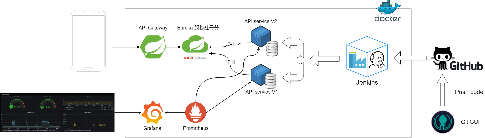

# 畢專文件_發表前

畢專文件_發表前
封面
誌謝
摘要
本文
第一章 緒論
第二章 系統功能介紹

第三章 系統前後端架構全景圖

第四章 系統前端架構
任務狀態流程
與後端API通訊的技術
具備讀取API的單元測試(V)

第五章
資料庫綱要
Spring Boot 實做RESTful API
具備資料庫讀取的單元測試(V)
使用Postman測試API (V)
API微服務與容器化
API微服務版本管理, 微服務註冊, APIGateway
自動部屬流程
監控微服務性能

第六章結論

附錄
開發環境
使用到的軟體工具

## 封面
**系所名稱**：資訊工程學系大學部
**畢專題目**：老人長照系統 (改名: 任務交易平台基於 Android 行動App 與容器化的後端服務) 
**指導教授**：陳錫民教授
**學生姓名**：葉育誠，陳怡汶，邱仁煜，彭彥潔
**日期**：２０２０年１０月３１日

## 誌謝
先省略 之後會補上

## 摘要
此系統為任務交易平台, 可以幫助用戶發佈任務, 而讓其他使用者接收並執行任務, 
例如有位長者想要搬動大量的重物, 但因行動不便, 無法動身, 則可以使用此系統發佈
搬動重物的任務, 並附上地址, 時間跟報酬, 則平台上會匹配適當的用戶去執行此任務,
達成雙方互利, 雙贏的局面。

本文件將會介紹系統前端的設計, 說明介面的規劃與功能, 和使用到的軟體設計模式, 
還會進一步說明後端的架構, 是如何部屬服務?, 如何管理API版本?, 和如何打造自動化的部屬流程?

此App的運行環境為 Android 行動裝置, 系統核心功能包含[發佈任務], [接收任務], [追蹤任務狀態],[管理任務], [用戶溝通介面], 提供使用者能在此平台上交易任務的必要功能。
針對以上複雜的系統功能, 我們後端使用到 Java 的 Spring Boot框架實做RESTful API, 為前端功能提供穩建的服務。

前端的 App, 大量使用到最新的布局技術與現代UI元件 例如:RecycleView, Material Design.
後端則是大量使用到Docker容器化技術部屬API服務, 也使用到 Spring Cloud Netflix 所以提供的 Eureka 服務註冊器, 註冊API服務, 進而管理API版本。

為了方便管理容器, 則是使用 Jenkins工具 搭配 GitHub網站 打造CI/CD的持續整合與持續部屬功能, 當開發者修改好新的API程式碼且 Push 到 GitHub 後, 自動化部屬流程就被觸發, 它將自動打包API服務並裝入Docker容器中運行。

在此報告中還會介紹系統核心的[任務狀態設計], [資料庫設計]。  
總結來說, 此專題打造的系統, 是包含前後端服務 和 容器化技術, 軟體版本控制, 軟體工具使用技術
所建造而成, 而此專題完全開源, 所有的程式碼都在後段章節所提供的GitHub連結中, 有興趣可以幫忙按個星星:)

- 關鍵詞：**任務交易平台**, **Android**, **Spring Boot**, **Docker**, **Jenkins**, **Git**

## 本文
--- 
### 第一章 緒論
#### 開發背景
近年來共享經濟盛行, 冒出了需多共用人力與資源的APP, 
例如Uber, Uber Eat, 小雞上工的找任務, 
而這些都是靠著網路發達與人口密集所造就的新趨勢。 
我們的 任務交易App, 也是屬於上述的類型, 可以由使用者選擇發佈或接收任務, 我們已經實現了一款更加簡單, 通用, 且有效率的任務交易App。
#### 開發動機

因為市面上非常缺少通用的任務交易App, 目前就我所知, 只有[小雞上工App]最近推出的找任務功能, 能夠達成交易任務的模式,所以我們不只想創造更加通用且簡單的任務交易App服務, 
更想在現今的軟體的市場中開創藍海市場。 

#### 開發目的
建構出可正常運行一個任務交易系統所必備的完整功能,
系統還需要有穩固的後端API, 資料庫, 與自動化部屬功能, 
前端的使用者介面, 不只要可以讓使用者選擇發佈與接收任務, 更可以讓使用者之間互相溝通, 追蹤任務狀態, 保存任務資訊, 達成全方位的任務管理與任務交易的系統。

## 第二章 系統功能介紹
<系統功能 樹狀圖>

[系統功能介紹](https://hackmd.io/8TEMENorSjSVPnj2WWLLGg?both)

## 第三章 系統微服務架構全景圖
以下為包含後端微服務架構與監控微服務容器

在此簡單介紹一下Docker, 以便說明此架構的設計,
Docker是一個運行容器的軟體, 而容器就是包含著獨立的作業系統與程式的單一顆粒, 也就是只要在容器中裝入Linux作業系統與程式的執行檔, 接著再命令Docker軟體運行此容器, 它即可在一個非常乾淨的環境下運行程式, 而容器也可以儲存成一個壓縮檔, 並提取出來, 放到任何一個有Docker軟體所在的電腦上, 再請Docker運行即可產生一致的結果。

在此後端系統中, 大量使用到Docker的容器化技術, 把可運行的API程式放入一個容器之中, 就能管理API版本與監控容器。

在此簡單的介紹一下Jenkins軟體, 它能夠自動建置與打包容器, 
當GitHub有新的程式碼時, 它會通知Jenkins, 而Jenkins會去GitHub拿取最新的程式碼, 接著編譯, 打包, 製作容器, 並命令Docker運行容器。

所以 // Todo

// Todo
可以在此圖中間右上方發現Docker 圖標, 這表示著在中間的矩形中
所涵蓋的都是Docker容器, 每一個容器

## 第三章 系統前端架構

### 任務狀態流程
* 以下先以 Boos 稱呼 發布任務的角色, Worker則是執行任務的角色。 
以下是我們程式內部所實做的設計圖。

這是狀態機圖, 在Boos創建任務後, 就會從此圖的START出發, 進入
已發佈狀態, 在此狀態下, 其他使用者可以申請執行此任務, 所以發佈任務不久後, 有可能
已被3位使用者所申請, 那接著發佈任務的Boos角色可以從這三位申請者中挑選執行任務的Worker,
假設Boos 已選擇Worker, 則此任務狀態會轉換到箭頭所指的端點, "Boos已選擇Worker",
在此狀態下Boos需等待Worker按下確認執行, 則任務才會轉換到 "任務執行中",
那如果Worker突然反悔剛才的申請, 不想按下確認執行, 怎麼辦呢?
可以發現在 "Boos已選擇Worker" 狀態有延伸出 Worker取消選擇的箭頭, 這是說明在此狀態下會提供給Worker反悔的選項, 他在按下取消選擇後, 任務的狀態會轉換到 已發佈狀態, 所以同時Boos可以再次重新選擇執行任務的Worker。

任務被執行中狀態, 當Worker執行完任務, 則可以按下請求Boos確認完成的按鈕, 那此任務狀態會轉換成 "等待Boos確認完成此任務",
Boos 可以選擇確認完成, 並給予Worker金錢報酬, 不過如果Worker完成的內容並未達到Boos所規定的, Boos 可以駁回此請求,
則任務狀態會變成 \[任務執行中\]。

而人與人的互動就一定存在者衝突的可能, 或許Worker遇上了非常難纏的Boos, 他確實已經完成任務, 但Boos確不斷駁回,
或是 Boos 遇上非常雷的Worker, 事情都沒確實做完成, 就不斷請求確認完成, 像是上述情境, 該如何解決呢?
其實這就像是現實生活中的合約, Boos 與 Worker都是可以要求毀約的, 以下介紹細節,

當Worker想直接毀約,是被允許的, 可以將任務轉換為 "failure end" 結束的狀態, 因為執行者都沒意願執行了, 總不能逼他做完吧
不過 Boos 角色是不能直接毀約的, Boos只能請求中止任務, 而必須得到Worker的同意才行, 這樣做是要保障Worker的權益, 避免該任務其實已被完成, 但卻被Boos惡意中止。

從此設計中會發現到, 如果Boos 不斷駁回任務, Worker也不中止任務的情況下, 該任務是會永遠停在任務執行中的狀態,
這是為了保留雙方的權益所設計的, 或許之後雙方能交由法律協調。

狀態流程的UI設計:
<圖> 說明各狀態下的功能 

### 與後端API通訊的技術
此前端App利用HTTP網路傳輸協定跟後端的API微服務通訊, 然而通訊的API格式為 RESTful API,
這是由 Roy Thomas Fielding 博士於2000年在他的博士論文中提出來的一種API風格,
例如我想知道此系統有哪些任務存在, 可以傳送 http://140.134.26.99/tasks 網址,
則後端系統使用Json格式回傳所有任務的資訊,  假設目前所有任務有兩組,
則它將傳送以下格式的資訊, 會顯示 任務ID:1 的資訊, 與 任務ID:2的資訊。 
{
    "1": {
        "Salary": 500,
        "TypeName": "清潔",
        "ReleaseUserID": 14,
        "ReceiveUserID": 0,
        "Message": "請幫我打掃庭院, 工具會幫您準備好",
        "TaskName": "打掃庭院",
        "ReleaseTime": "2020-11-01T15:40:50",
        "TaskAddress": "台中市文華路100號",
        "StartPostTime": "2020-11-03T12:00:00",
        "EndPostTime": "2020-11-03T15:00:00"
    },
    "2": {
        "Salary": 450,
        "TypeName": "購物",
        "ReleaseUserID": 2,
        "ReceiveUserID": 0,
        "Message": "請幫我買價錢300元內的延長線",
        "TaskName": "購買延長線",
        "ReleaseTime": "2020-11-02T8:40:00",
        "TaskAddress": "台中市文華路800號",
        "StartPostTime": "2020-11-04T18:00:00",
        "EndPostTime": "2020-11-04T17:00:00"
    }
}

,  又或者我只想知道 Task ID 1 的資訊就好, 在RESTful API格式中, 
可以傳送 http://140.134.26.99/tasks/1 網址, 則後端將只會回應任務ID為1的資訊, 如下

{
    "1": {
        "Salary": 500,
        "TypeName": "清潔",
        "ReleaseUserID": 14,
        "ReceiveUserID": 0,
        "Message": "請幫我打掃庭院, 工具會幫您準備好",
        "TaskName": "打掃庭院",
        "ReleaseTime": "2020-11-01T15:40:50",
        "TaskAddress": "台中市文華路100號",
        "StartPostTime": "2020-11-03T12:00:00",
        "EndPostTime": "2020-11-03T15:00:00"
    }
}

那前端App 是如何傳送此API的網址, 給後端的呢? 
這邊我們使用, OkHttp, 這是由 Square 出產的開源專案, 可以有效率的運行HTTP連線,

如下方法, 為傳送 拿到所有任務的API網址

---------------------------------------------------------------------------
Request request = new Request.Builder()   // 提供連線資訊
                        .url("http://140.134.26.99/tasks")
                        .method("GET", null)
                        .build(); 
                        
OkHttpClient client = new OkHttpClient().newBuilder().build(); // 利用 OkHttp 建造 OkHttpClient 連線物件
Response response= client.newCall(request).execute(); // 將連線資訊 傳入 連線物件並執行

---------------------------------------------------------------------

當然串接API的程式碼不只有這樣簡單的三行, 之後還需要處理JSON格式轉換, 非同步運行等等的細節,
如果我把程式碼全貼上來, 那就太占篇幅了, 
這在專案的 src/main/java/Task/TaskAPIService.java中可以找到。

在這裡稱呼 TaskAPIService , 為一個服務元件, 這物件主要封裝系統在拿取API服務的操作細節,
而系統中所有API服務元件如下:
TaskAPIService.java      // 發佈任務, 拿取任務狀態 ... 
MessageAPIService.java  // 聊天, 傳訊息, 查看誰傳訊息 ...
UserAPIService.java    // 登入 登出 拿取使用者資訊 ...

以上為簡單介紹此系統的API樣貌, 可以初步了解系統的架構 
更多的系統細節會如剝洋蔥般, 一層一層的在往後的章節說明。

### 具備讀取API的單元測試(V)

[參考](https://hackmd.io/@9qakRthtSPSYbGjjVCtE0A/SJw7gJ-FD)

## 第四章
### 資料庫綱要
// Todo <圖>

// Todo <說明為何如此設計>

### Spring Boot 實做RESTful API

### 具備資料庫讀取的單元測試(V)
### 使用Postman測試API (V)
### API微服務與容器化
### API微服務版本管理, 微服務註冊, APIGateway 
### 自動部屬流程
### 監控微服務性能

## 第五章結論

## 附錄
### 開發環境
前端行動APP使用 Google 所提供的 Android Studio IDEA.
後端微服務使用 Intellij IDEA

### 使用到的軟體工具

後端資料庫使用 MySQL

使用Postman測試API
- Postman 提供功能强大的 Web API 和 HTTP 请求的调试，它能够发送任何类型的HTTP 请求 (GET, POST, PUT, DELETE…)，并且能附带任何数量的参数和 Headers。不仅如此，它还提供测试数据和环境配置数据的导入导出，付费的 Post Cloud 用户还能够创建自己的 Team Library 用来团队协作式的测试，并能够将自己的测试收藏夹和用例数据分享给团队。

使用Git管理程式碼版本
- git是用於Linux核心開發的版本控制工具。與CVS、Subversion一類的集中式版本控制工具不同，它採用了分散式版本庫的作法，不需要伺服器端軟體，就可以運作版本控制，使得原始碼的釋出和交流極其方便。git的速度很快，這對於諸如Linux核心這樣的大專案來說自然很重要。git最為出色的是它的合併追蹤（merge tracing）能力。

- 實際上核心開發團隊決定開始開發和使用git來作為核心開發的版本控制系統的時候，世界上開源社群的反對聲音不少，最大的理由是git太艱澀難懂，從git的內部工作機制來說，的確是這樣。但是隨著開發的深入，git的正常使用都由一些友善的命令來執行，使git變得非常好用。現在，越來越多的著名專案採用git來管理專案開發，例如：wine、U-boot等。

- 作為開源自由原教旨主義專案，git沒有對版本庫的瀏覽和修改做任何的權限限制，通過其他工具也可以達到有限的權限控制，比如：gitosis、CodeBeamer MR。原本git的使用範圍只適用於Linux/Unix平台，但在Windows平台下的使用也日漸成熟，這主要歸功於Cygwin、msysgit環境，以及TortoiseGit這樣易用的GUI工具。git的原始碼中也已經加入了對Cygwin與MinGW編譯環境的支援且逐漸完善，為Windows使用者帶來福音。

使用 Docker 來部屬後端API
- Docker 是一種軟體平台，可讓您快速地建立、測試和部署應用程式。Docker 將軟體封裝到名為容器的標準化單位，其中包含程式庫、系統工具、程式碼和執行時間等執行軟體所需的所有項目。使用 Docker，您可以將應用程式快速地部署到各種環境並加以擴展，而且知道程式碼可以執行。

使用Jenkins打造CI/CD流程
- Jenkins是一个开源的、提供友好操作界面的持续集成(CI)工具，主要用于持续、自动的构建/测试软件项目、监控外部任务的运行（这个比较抽象，暂且写上，不做解释）。Jenkins用Java语言编写，可在Tomcat等流行的servlet容器中运行，也可独立运行。

系統後端API使用微服務架構
- 微服務架構是以專注於單一責任與功能的小型功能區塊 (Small Building Blocks) 為基礎，利用模組化的方式組合出複雜的大型應用程式，各功能區塊使用與語言無關 (Language-Independent/Language agnostic) 的 API 集相互通訊。

微服務是使用 JAVA 語言所撰寫的 Spring Boot 框架開發
- Spring框架是Java平台上的一種開源應用框架，提供具有控制反轉特性的容器。儘管Spring框架自身對編程模型沒有限制，但其在Java應用中的頻繁使用讓它備受青睞，以至於後來讓它作為EJB（EnterpriseJavaBeans）模型的補充，甚至是替補。

使用okhttp，串接後端API
- okhttp是一个第三方类库，用于android中请求网络。

- 这是一个开源项目,是安卓端最火热的轻量级框架,由移动支付Square公司贡献(该公司还贡献了Picasso和LeakCanary) 。用于替代HttpUrlConnection和Apache HttpClient(android API23 里已移除HttpClient)

API格式使用RESTfulAPI 
- REST 是一種軟體架構風格（並非標準），目的是幫助在世界各地不同軟體、程式在網際網路中能夠互相傳遞訊息。每一個網頁都可視為一個資源（resource）提供使用者使用，而你可以透過 URL（Uniform Resource Locator），也就是這些資源的地址，來取得這些資源並在你的瀏覽器上使用。

#### 系統架構
- 後端使用微服務的架構。
- API的部分使用自動建構的服務，在Git中Push後就能使用本地測試，以加快黑箱測試的速度。

